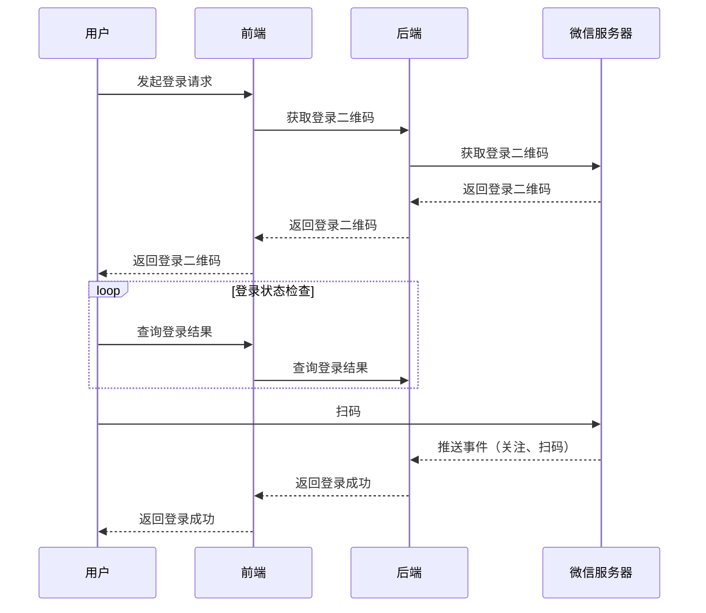

```mermaid
%% 时序图例子,-> 直线，-->虚线，->>实线箭头
  sequenceDiagram
    participant 用户
    participant 前端
    participant 后端
    participant 微信服务器
    用户->>前端: 发起登录请求
    前端->>后端: 获取登录二维码
    后端->>微信服务器: 获取登录二维码
    微信服务器-->>后端: 返回登录二维码
    后端-->>前端: 返回登录二维码
    前端-->>用户: 返回登录二维码
    loop 登录状态检查
        用户->>前端: 查询登录结果
        前端->>后端: 查询登录结果
    end
    用户->>微信服务器: 扫码
    微信服务器-->>后端: 推送事件（关注、扫码）
    后端-->>前端: 返回登录成功
    前端-->>用户: 返回登录成功
```
